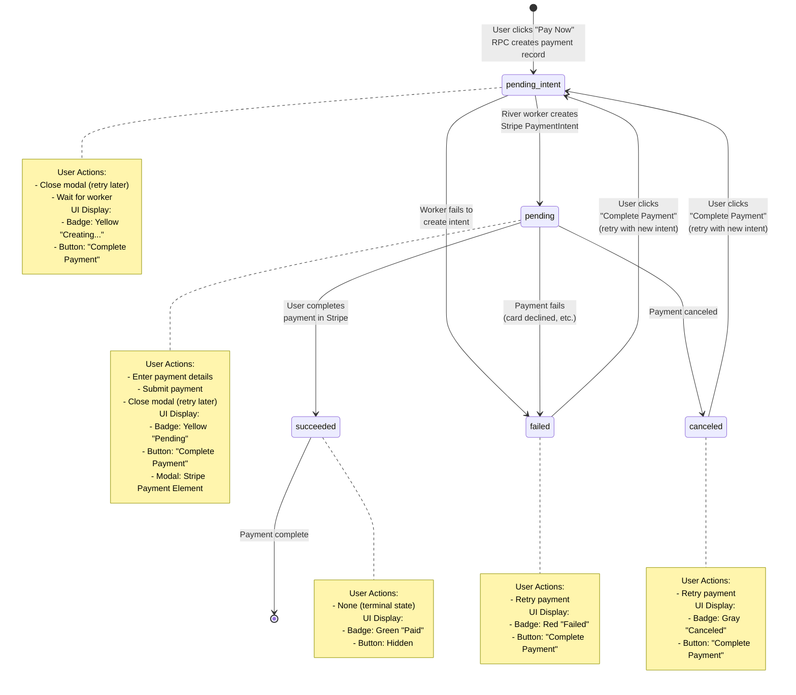

# Payment State Diagram

This document describes the payment transaction lifecycle in Civic OS.

## State Diagram



## State Descriptions

### `pending_intent`
**Database Status:** `status = 'pending_intent'`

**What It Means:**
- Payment record exists in database
- Waiting for River worker to create Stripe PaymentIntent
- No Stripe resources created yet

**User Experience:**
- Modal may show "Processing..." briefly
- Can close modal and retry later
- Same payment record will be reused on retry

**Technical Details:**
- Created by: `initiate_reservation_request_payment()` RPC
- Trigger: `enqueue_create_intent_job_trigger` fires on INSERT
- Worker Job: `create_payment_intent` (River job kind)
- Next State: `pending` (success) or `failed` (error)

---

### `pending`
**Database Status:** `status = 'pending'`

**What It Means:**
- Stripe PaymentIntent created successfully
- `provider_client_secret` populated
- Waiting for user to complete payment

**User Experience:**
- Modal displays Stripe Payment Element
- User can enter card details and submit
- Can close modal and retry later (same PaymentIntent)

**Technical Details:**
- Set by: River worker after successful Stripe API call
- Stripe Resource: PaymentIntent with status `'requires_payment_method'`
- Client Secret: Used by Stripe Elements SDK in browser
- Next State: `succeeded`, `failed`, or `canceled` (via webhook)

---

### `succeeded`
**Database Status:** `status = 'succeeded'`

**What It Means:**
- Payment completed successfully
- Funds captured by Stripe
- Terminal state (no further transitions)

**User Experience:**
- Green badge with checkmark: "Paid"
- "Pay Now" button hidden
- User can proceed with workflow (admin approval, etc.)

**Technical Details:**
- Set by: Webhook processing job
- Webhook Event: `payment_intent.succeeded`
- Trigger: No actions, terminal state

---

### `failed`
**Database Status:** `status = 'failed'`

**What It Means:**
- Payment attempt failed
- Could be: card declined, insufficient funds, invalid card, etc.
- User can retry with new PaymentIntent

**User Experience:**
- Red badge with error icon: "Failed"
- "Complete Payment" button visible
- Error message may be shown in UI

**Technical Details:**
- Set by: Webhook processing job OR worker (if intent creation fails)
- Webhook Event: `payment_intent.payment_failed`
- Retry: Clicking button creates NEW PaymentIntent (fresh attempt)
- Error Message: Stored in `error_message` column

---

### `canceled`
**Database Status:** `status = 'canceled'`

**What It Means:**
- Payment was explicitly canceled
- Not an error, but intentional cancellation
- User can retry if they change their mind

**User Experience:**
- Gray badge with cancel icon: "Canceled"
- "Complete Payment" button visible
- No error message

**Technical Details:**
- Set by: Webhook processing job (admin cancellation in Stripe Dashboard)
- Webhook Event: `payment_intent.canceled`
- Retry: Clicking button creates NEW PaymentIntent

---

## Button Visibility Logic

The "Pay Now" / "Complete Payment" button is shown when:

```typescript
// Show button if:
// 1. No payment exists (null)
// 2. Payment exists but is NOT succeeded

if (paymentValue == null) {
  return true; // Show "Pay Now"
}

if (paymentValue.status !== 'succeeded') {
  return true; // Show "Complete Payment"
}

return false; // Hide button (payment succeeded)
```

**Button Text:**
- No payment: `"Pay Now"`
- Payment exists (incomplete): `"Complete Payment"`

---

## Payment Reuse vs. Retry

### Reuse (Same PaymentIntent)
**States:** `pending_intent`, `pending`

When user clicks "Complete Payment" for an incomplete payment:
1. Frontend checks if `existingPayment.id` exists
2. If yes, reuses that payment ID → opens modal
3. No RPC call needed
4. Same Stripe PaymentIntent is used

**Why:** Avoids creating duplicate payment records and Stripe intents.

### Retry (New PaymentIntent)
**States:** `failed`, `canceled`

When user clicks "Complete Payment" for a failed/canceled payment:
1. Frontend calls `initiate_reservation_request_payment()` RPC
2. RPC returns existing payment ID (idempotent)
3. River worker creates NEW Stripe PaymentIntent
4. Old intent is abandoned, new intent is used

**Why:** Failed/canceled intents cannot be reused. Must create fresh intent.

---

## Database Schema

### `payments.transactions` Table

```sql
CREATE TABLE payments.transactions (
  id UUID PRIMARY KEY DEFAULT gen_random_uuid(),
  user_id UUID NOT NULL REFERENCES metadata.civic_os_users(id),

  -- Amount and Currency
  amount NUMERIC(10, 2) NOT NULL,
  currency TEXT NOT NULL DEFAULT 'USD',

  -- Status Tracking
  status TEXT NOT NULL DEFAULT 'pending_intent',
  error_message TEXT,

  -- Stripe Integration
  provider TEXT NOT NULL DEFAULT 'stripe',
  provider_payment_id TEXT,        -- Stripe PaymentIntent ID (pi_...)
  provider_client_secret TEXT,     -- client_secret for Stripe Elements

  -- Metadata
  description TEXT,
  display_name TEXT GENERATED ALWAYS AS (...) STORED,

  -- Timestamps
  created_at TIMESTAMPTZ NOT NULL DEFAULT NOW(),
  updated_at TIMESTAMPTZ NOT NULL DEFAULT NOW(),

  CONSTRAINT valid_status CHECK (status IN (
    'pending_intent',
    'pending',
    'succeeded',
    'failed',
    'canceled'
  ))
);
```

---

## Webhook Processing

### Flow
1. Stripe sends webhook event to `/rpc/process_payment_webhook`
2. `process_payment_webhook()` RPC inserts into `metadata.webhooks` table
3. Trigger fires: `enqueue_process_webhook_job_trigger`
4. River job processes webhook: updates `payments.transactions.status`

### Handled Events
- `payment_intent.succeeded` → `status = 'succeeded'`
- `payment_intent.payment_failed` → `status = 'failed'`
- `payment_intent.canceled` → `status = 'canceled'`

### Idempotency
- Webhooks table has `UNIQUE (provider, provider_event_id)` constraint
- Duplicate webhooks return early with `duplicate: true` response
- Prevents double-processing of same event

---

## Error Handling

### Worker Failures
If River worker fails to create Stripe intent:
- Payment remains in `pending_intent` with error message
- User sees error in UI
- Can retry by clicking "Complete Payment" again

### Payment Failures
If user's payment fails (card declined):
- Webhook updates status to `failed` with error message
- User sees "Failed" badge
- Can retry with new PaymentIntent

### Network Failures
If modal is closed during submission:
- Payment may be in `pending` state
- User can reopen modal and complete payment
- Same Stripe PaymentIntent is reused (no duplicate charge)

---

## Security Considerations

### Row Level Security (RLS)
```sql
-- Users can only see their own payments
CREATE POLICY "Users see own payments"
  ON payments.transactions
  FOR SELECT TO authenticated
  USING (user_id = current_user_id());
```

### SECURITY DEFINER Functions
- `initiate_reservation_request_payment()`: Checks ownership before creating payment
- `enqueue_create_intent_job()`: Trigger function runs with elevated privileges
- `process_payment_webhook()`: Public endpoint (webhooks from Stripe)

### Client Secret Security
- `provider_client_secret` is returned to frontend ONLY for user's own payments
- Used by Stripe Elements SDK to complete payment
- Short-lived (expires after 24 hours)
- Cannot be used to issue refunds or view payment details

---

## Testing Checklist

### Happy Path
- [ ] Create payment (`pending_intent`)
- [ ] Worker creates intent (`pending`)
- [ ] User completes payment (`succeeded`)
- [ ] Button disappears
- [ ] Badge shows green "Paid"

### Retry - Close Modal
- [ ] Start payment
- [ ] Close modal before completing
- [ ] Reopen detail page
- [ ] Button shows "Complete Payment"
- [ ] Click button → same payment ID used

### Retry - Failed Payment
- [ ] Use test card `4000000000000002` (declined)
- [ ] Payment fails (`failed`)
- [ ] Badge shows red "Failed"
- [ ] Click "Complete Payment"
- [ ] New PaymentIntent created

### Retry - Canceled Payment
- [ ] Cancel PaymentIntent in Stripe Dashboard
- [ ] Webhook updates status to `canceled`
- [ ] Badge shows gray "Canceled"
- [ ] Click "Complete Payment"
- [ ] New PaymentIntent created

### Edge Cases
- [ ] Multiple rapid clicks on "Pay Now" (idempotency)
- [ ] Webhook arrives before user refreshes page
- [ ] Worker timeout (30+ seconds)
- [ ] Invalid card details (validation errors)

---

## Future Enhancements

### Metadata-Driven Configuration
Add `payment_initiation_rpc` column to `metadata.entities`:

```sql
ALTER TABLE metadata.entities
  ADD COLUMN payment_initiation_rpc TEXT;

-- Configure for reservation_requests
UPDATE metadata.entities
SET payment_initiation_rpc = 'initiate_reservation_request_payment'
WHERE table_name = 'reservation_requests';
```

### Refunds
Add new states:
- `refund_pending` - Refund initiated
- `refunded` - Refund completed

### Partial Payments
Allow splitting payment across multiple transactions.

### Scheduled Payments
Add `scheduled_at` timestamp for deferred charging.
